# Sentiment Analysis Summary

- Total posts analyzed: 597

## Post Label Distribution
| Post_Label   |   count |
|:-------------|--------:|
| Positive     |     370 |
| Negative     |     213 |
| Neutral      |      14 |

## Comment Label Distribution
| Comment_Label   |   count |
|:----------------|--------:|
| Positive        |     394 |
| Negative        |     168 |
| Neutral         |      35 |

## Full Label Distribution
| Full_Label   |   count |
|:-------------|--------:|
| Positive     |     408 |
| Negative     |     188 |
| Neutral      |       1 |

## 📂 Output CSV Files
- `reddit_with_sentiment.csv`
- `sample_comments_all_sentiments.csv`
- `sentiment_by_search_term.csv`
- `subreddit_sentiment_averages.csv`

## 🖼️ Output Charts
- 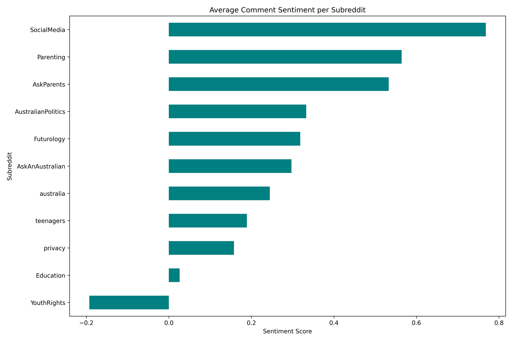
- 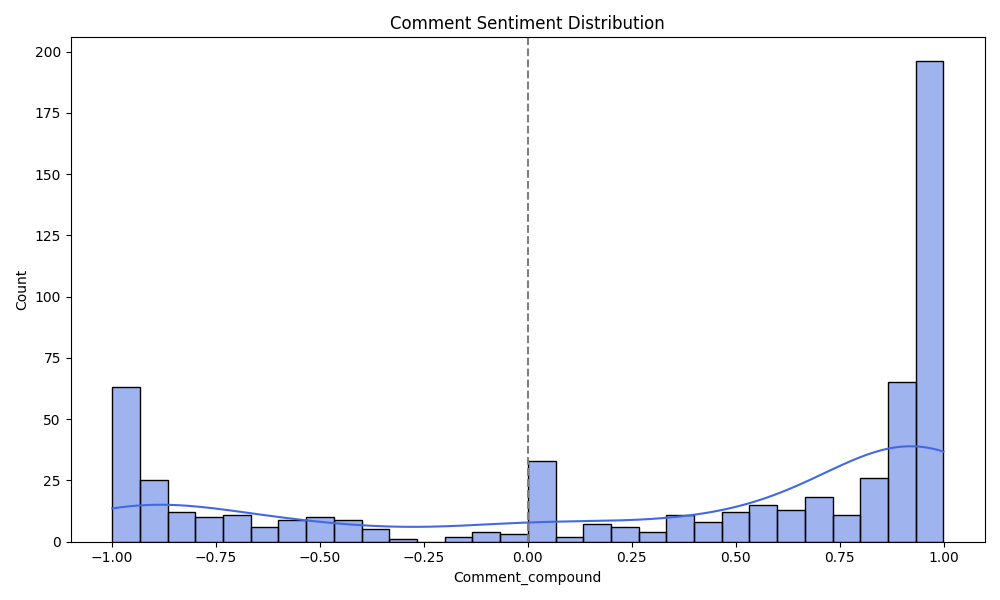
- 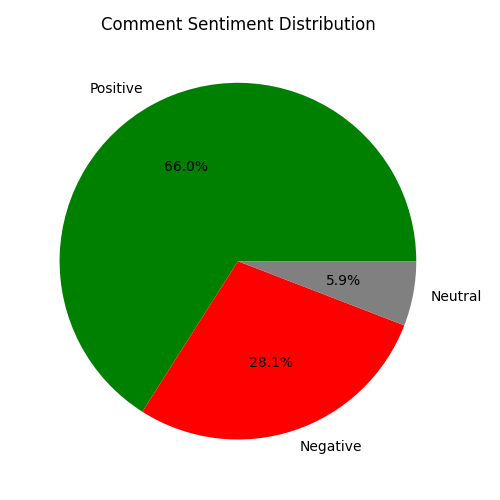
- 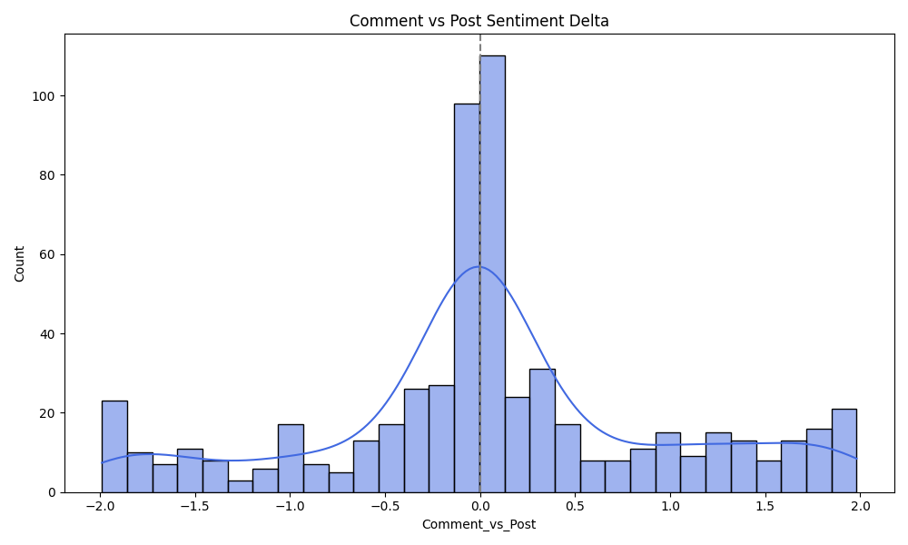
- 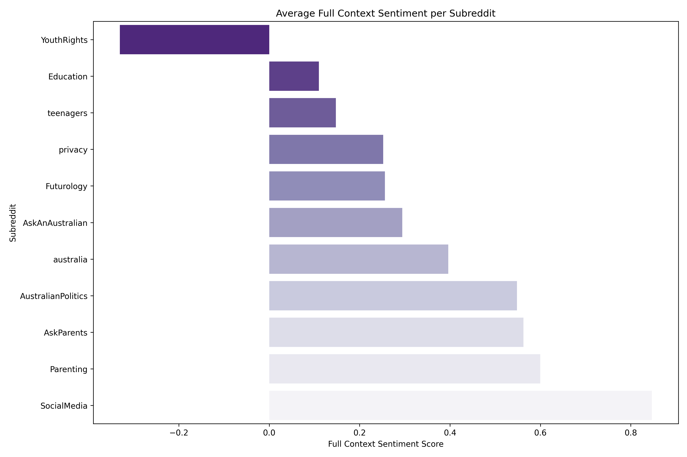
- 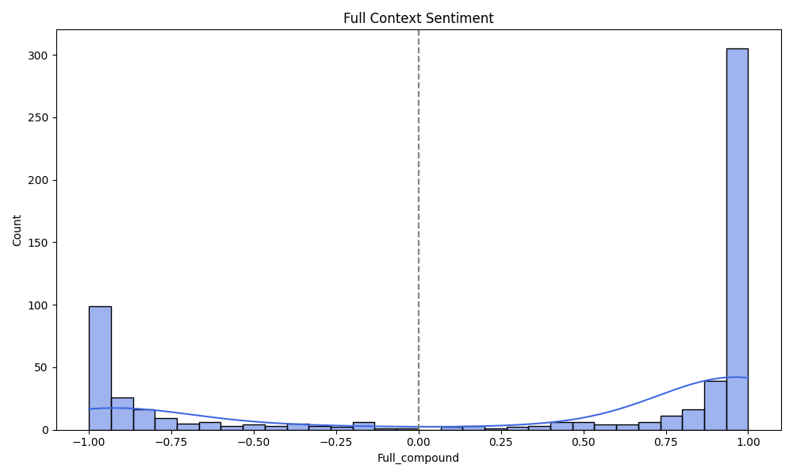
- 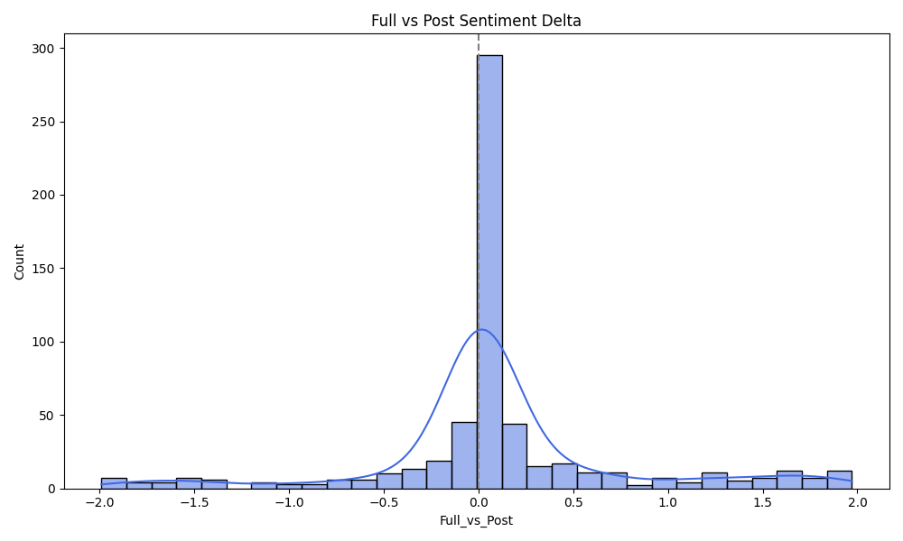
- 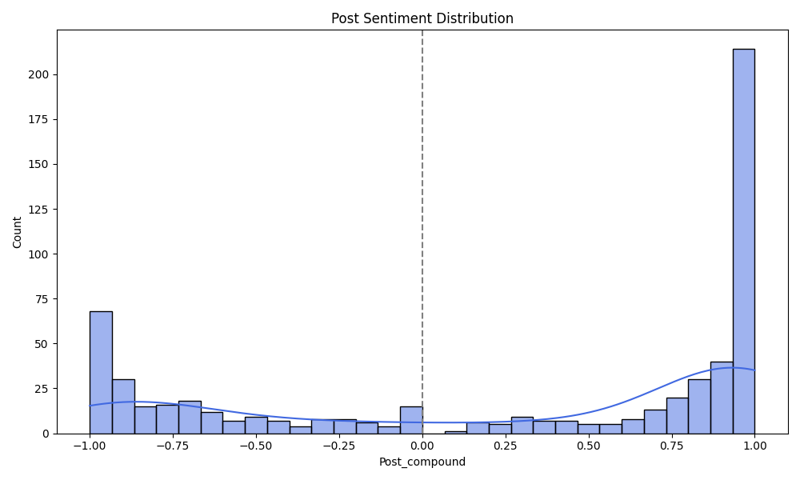
- 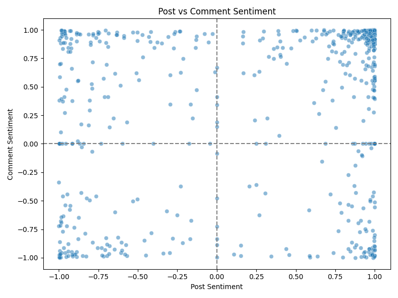
- 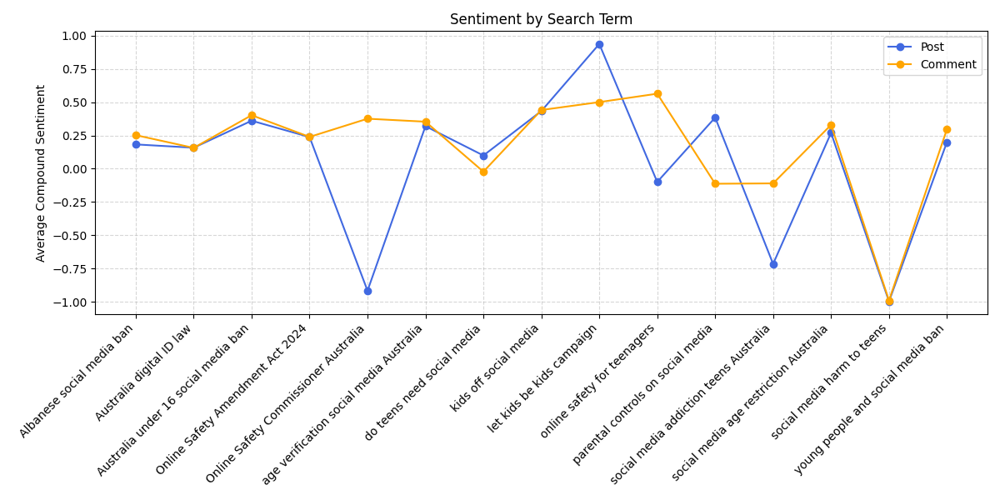
- 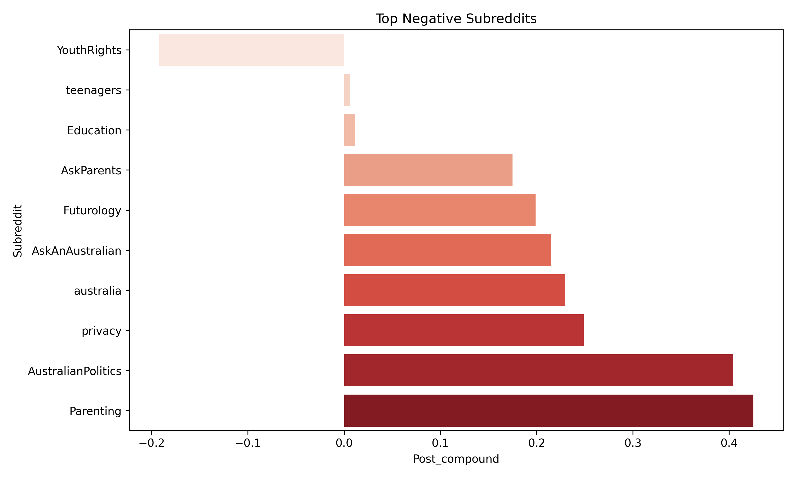
- 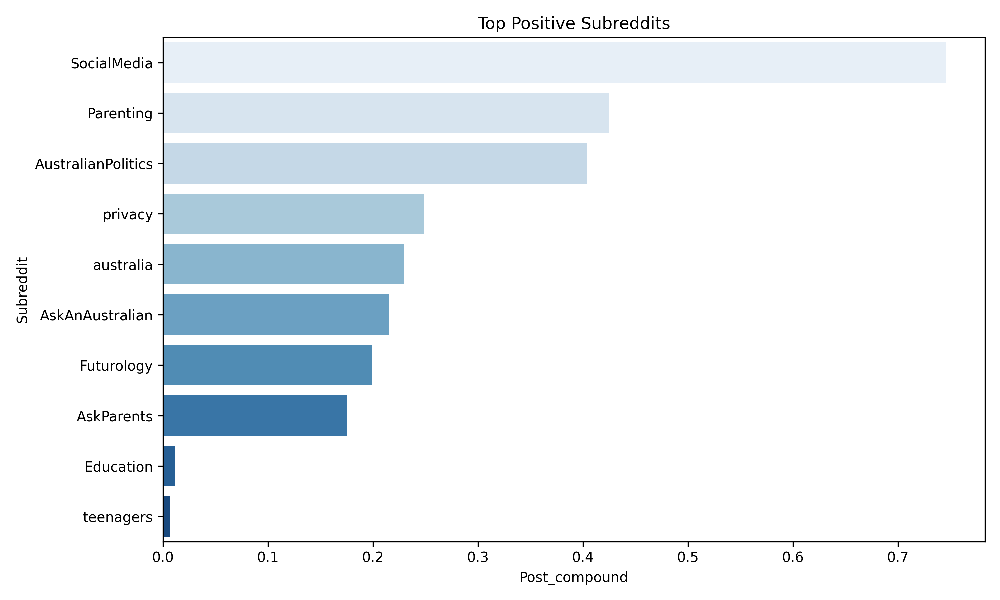

## 📄 Output Text Files
- `sample_comments.txt`
